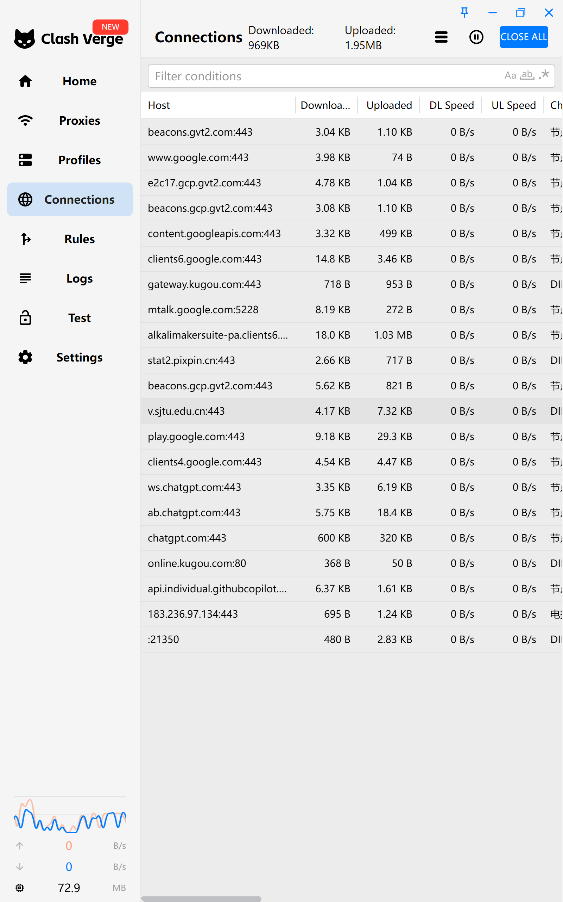

title: 掌控比特流：从 Clash 假 IP 陷阱到流量分析的折腾
date: 2025-12-16 20:00:00
tags: [Network, Clash, SJTU, DNS, Privacy, CS]
categories: [技术, 折腾日志]
---

作为一个计算机专业的学生，最近访问校内资源时遇到个痛点：开着代理（Clash）访问校内网看课程回放时速度很慢（v.sjtu.edu.cn），关了代理又上不去 GitHub 用不了 ChatGPT。

起初我以为加个直连规则（Direct）就能搞定，结果却掉进了 DNS 解析的“坑”里。

难道我还要频繁开关 VPN 吗？显然不。不仅如此，我还解决了一下广告拦截和隐私保护的问题，顺便预习了一下计算机网络原理。

<!--more-->

## 0x01 代理与局域网的冲突

起因很简单，当我在使用 Clash Verge 访问外网查资料时，同时需要访问学校的 `v.sjtu.edu.cn` 观看课程回放。结果浏览器一直转圈，或者缓冲极慢。

### 原理分析
**Clash 本质上是一个基于规则的流量转发器**。
当开启“全局模式”或者默认规则配置不当时，Clash 这个“传达室大爷”会把发往 `sjtu.edu.cn` 的请求也打包发给了位于美国的代理服务器。美国服务器拿着请求去访问交大内网，绕了地球一圈延迟极高。

## 0x02 从 DIRECT 到 Fake-IP 的排错之路

### 第一阶段：天真的 DIRECT
我最初的想法是：**Split Tunneling（分流）**。告诉 Clash：“凡是交大的域名，直接走本地网卡（DIRECT）；其他的，再走代理。”

于是我加了规则，但我发现：**依然很慢**，虽然能打开，但远没有平时直连那种秒开的速度。

### 第二阶段：发现 Fake-IP 的锅
经过排查，我发现问题出在 Clash 的 **Fake-IP 模式**上。

1.  **Clash 的工作流**：在 Fake-IP 模式下，Clash 会立即返回一个假 IP（如 198.18.x.x）给浏览器，然后自己在后台解析域名。
2.  **DNS 甚至比路由更重要**：即使我设置了 `DIRECT`，Clash 依然负责了解析 IP。由于 Clash 为了防污染通常使用远程 DNS（如 8.8.8.8），SJTU 的 CDN 服务器误以为我是公网用户，给我返回了一个**公网 IP**，而不是**校内内网 IP**。
3.  **结果**：我明明在校内，流量却走了公网出口绕了一圈回来，带宽被限死。

### 最终方案：Fake-IP Filter
要实现“秒开”，必须让操作系统使用学校 DHCP 下发的本地 DNS 进行解析，拿到内网 IP。

以下是我的最终配置方案（使用 Clash Verge 的 Merge 功能），包含了 **Fake-IP 过滤** + **SJTU 直连** + **去广告**：

```yaml
# Profile Merge Configuration

# 1. 核心修复：跳过 Fake-IP (让本地 DNS 接管解析，获取内网高速 IP)
dns:
  enable: true
  fake-ip-filter:
    - "+.sjtu.edu.cn"
    - "+.lan"
    - "+.local"

# 2. 引入外部规则集 (Rule Providers)
# 使用 Loyalsoldier 的规则库，每日自动更新
rule-providers:
  reject:
    type: http
    behavior: domain
    url: "https://cdn.jsdelivr.net/gh/Loyalsoldier/clash-rules@release/reject.txt"
    path: ./ruleset/reject.yaml
    interval: 86400

# 3. 规则插入 (Prepend Rules)
# Clash 匹配是 "First Match Wins"，必须插到最前面
prepend-rules:
  # === 第一优先级：SJTU 校内网直连 ===
  - DOMAIN-SUFFIX,sjtu.edu.cn,DIRECT
  - DOMAIN-KEYWORD,sjtu,DIRECT

  # === 第二优先级：去广告与隐私保护 ===
  - RULE-SET,reject,REJECT
```
配置生效后，fake-ip-filter 强制系统本地解析交大域名，拿到内网 IP，可以用命令`nslookup v.sjtu.edu.cn`验证，由于我正在使用TUN模式，clash会拦截所有流量，因此返回
```
Server:  UnKnown
Address:  198.18.0.2

Name:    v.sjtu.edu.cn
Address:  202.120.35.151
```
展示了电脑先问clash，再返回`202.120.35.151`
诶，好像不对，不应该返回局域网ip，类似`192.168.x.x` 吗？？
哦，原来交大拥有整个`202.120.x.x`公网ip块，财大气粗的它直接不用使用NAT，而是为内部服务器分配公网ip！
现在访问 v.sjtu.edu.cn 简直是 Blazingly Fast，同时后台的 YouTube 依然流畅 4K。Comfortable.

## 0x03 流量分析

配置完成后，我不小心打开了 Clash 的 Connections 面板，仿佛打开了一个简化版的 Wireshark。看着后台跳动的连接，不得不感叹现代 Web 架构的复杂。



通过观察日志，我发现了几个有趣的现象：

1.  **微服务架构**：
    访问 ChatGPT 不仅仅是一个 HTTP 请求。我看到了 `ws.chatgpt.com`（WebSocket 长连接，用于流式传输回复）、`ab.chatgpt.com`（A/B 测试接口）、`auth0.openai.com`（鉴权服务）。这正是分布式微服务架构的典型体现。

2.  **无处不在的 Telemetry（遥测）**：
    即使我什么都没干，后台也充满了 `beacons.gvt2.com` (Google 追踪)、`stat.pixpin.cn` (软件日活打点)。这就是为什么我们需要在网关层级做隐私保护——浏览器插件挡不住软件后台的上传。

3.  **生产力工具的流量**：
    `api.individual.githubcopilot.com` 一直在活跃。vscode中的Copilot 实时把我的代码上下文发回 GitHub 进行推理。

## 0x04 踩坑记录：13GB 日志

在折腾过程中，我发现无知带来的错误。我之前开启了 `log-level: debug` 并且配置了日志写入文件。我发现 13GB的C 盘被日志文件占据

**教训：**
1.  日常使用务必将日志等级设为 `Info` 或 `Silent`。
2.  除非调试，否则不要配置 `log-file`。

## 0x05 Edge AI 与网络边界

在清理浏览器缓存时，我意外发现 Chrome 甚至下载了本地神经网络模型（应该是用于 Safe Browsing 和实时字幕）。

这让我意识到，未来的网络不仅仅是传输数据，**计算正在向边缘（Edge）迁移**。浏览器不再只是一个渲染器，它正在变成一个推理引擎。

## 0x06 总结

这次折腾不仅解决了实际上网的痛点，更是一次对《计算机网络》课程的预习🤣。

---
*本文仅供技术交流与学习，请遵守当地法律法规。*
*本文为ai辅助写作，否则主播文笔太差了...*