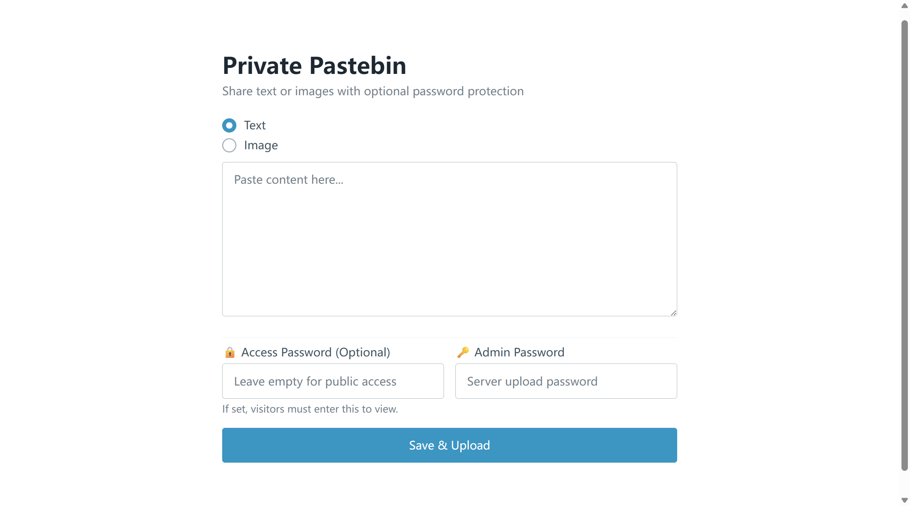
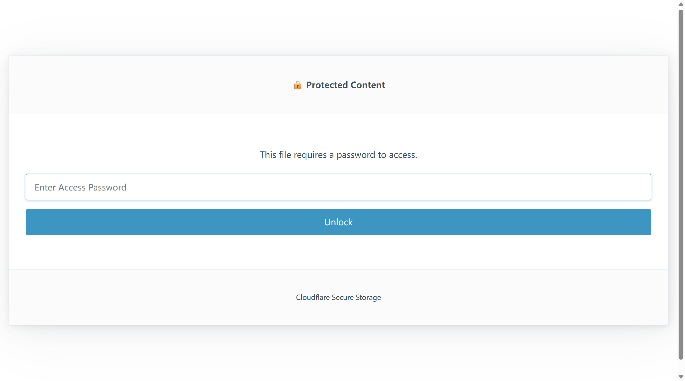

title: 告别微信文件传输助手：用 Cloudflare Workers 手搓一个加密 Pastebin
date: 2025-12-19
tags: 
  - Cloudflare
  - Serverless
  - DIY
  - JavaScript
categories: [技术, 折腾日志]
---

## 前言：域名的无限可能

平时在电脑和手机之间传一段代码、一个 Token，或者一张截图，我总是习惯性地打开微信的“文件传输助手”。但把数据交给第三方总觉得不够“优雅”，而且还得在不同设备上登录微信，很麻烦。

我想：**为什么不利用我的域名，做一个自己的“剪贴板中转站” (Pastebin) 呢？**

不用买服务器，不用装 Nginx，就用 **Cloudflare Workers + KV**，全免费，速度快。

<!--more-->

## 架构设计：Serverless 的魅力

传统的 Pastebin 可能需要后端语言 (PHP/Python) + 数据库 (MySQL)。但在这个 Serverless 的时代，一切都变了。

我的方案如下：
*   **计算 (Brain):** **Cloudflare Workers**。一段 JavaScript 代码，分发在全球几百个边缘节点。不管我在哪里访问，响应速度都是毫秒级的。
*   **存储 (Memory):** **Cloudflare KV (Key-Value)**。一个分布式的键值对存储。非常适合“写一次，读多次”的场景。

**核心需求：**
1.  **极简交互**：打开网页就能粘贴，支持文字和图片。
2.  **Base64 黑魔法**：因为 KV 主要存文本，我决定把图片转成 Base64 字符串存储，读取时再还原为二进制流，这样手机浏览器能直接识别。
3.  **双重鉴权**：
    *   **上传锁**：防止路人滥用我的存储空间，上传时需要“管理员密码”。
    *   **访问锁**：支持给特定文件设置“提取码”，类似百度网盘，阅后即焚或私密分享神器。

## 折腾过程

### 1. 初始化项目
一行命令搞定环境：
```bash
npm create cloudflare@latest my-pastebin
```
选择 `Hello World` 模板，配置好 `wrangler.toml` 绑定 KV 空间，一切准备就绪。

### 2. 攻克图片存储
最开始我只做了文本存储，后来觉得太单调。为了支持图片，我在前端使用了 `FileReader` API。

当用户选择图片时，前端 JS 会把它转成一串长长的 Base64 字符串：
```javascript
// 前端逻辑片段
reader.readAsDataURL(file); // 变成 data:image/png;base64,.....
```

而在后端 Worker 里，当识别到这是图片数据时，再把这串字符“变回”图片返回给浏览器：
```javascript
// 后端逻辑片段
const binaryString = atob(b64Data);
// ... 转为 Uint8Array ...
return new Response(bytes.buffer, {
    headers: { 'Content-Type': 'image/png' }
});
```
这样，访问短链接时，浏览器展示的就是一张真正的图，而不是乱码。

### 3. 实现“提取码”功能
这是我觉得最酷的部分。我在数据结构里加了一个 `access_password` 字段。

当有人访问链接时，Worker 会先看一眼这个文件有没有密码：
*   **没密码** -> 直接把内容甩给你。
*   **有密码** -> 拦截请求，返回一个带有“🔒 Protected Content”的 HTML 页面，让你输入密码。

这完全模拟了网盘的体验，而且逻辑全部写在一个 `index.js` 文件里，干净利落。

## 成果展示

现在，我的域名 `woftom.online` 拥有了一个隐藏入口。

**上传界面：**


**加密访问：**
当我把私密照片的链接发给朋友时，他会看到这个：

输入正确密码后，图片瞬间加载，体验丝滑。

## 总结

整个项目大概只用了不到 200 行代码。豪玩！

---
*本文基于 Cloudflare Workers 构建，感谢 Cloudflare 提供的免费额度。*