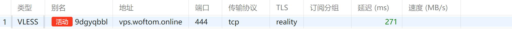
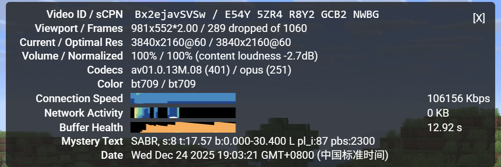
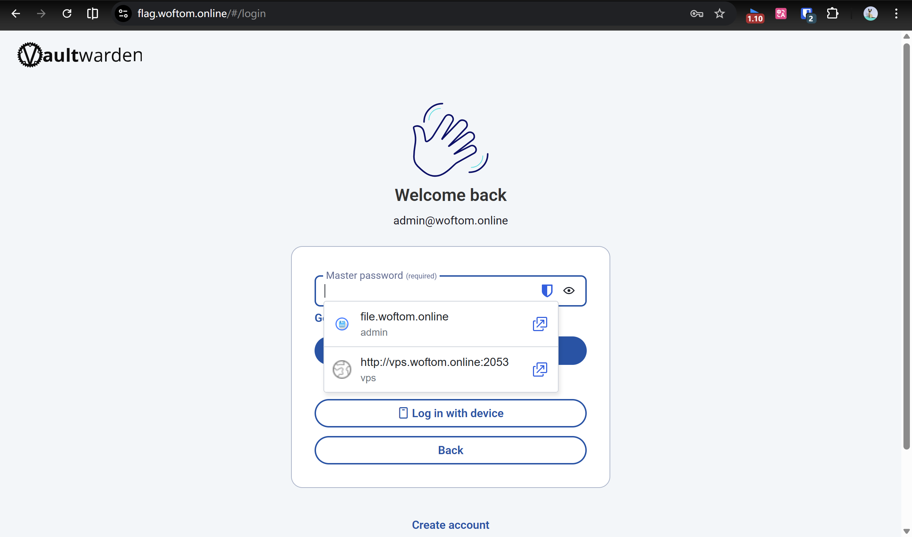
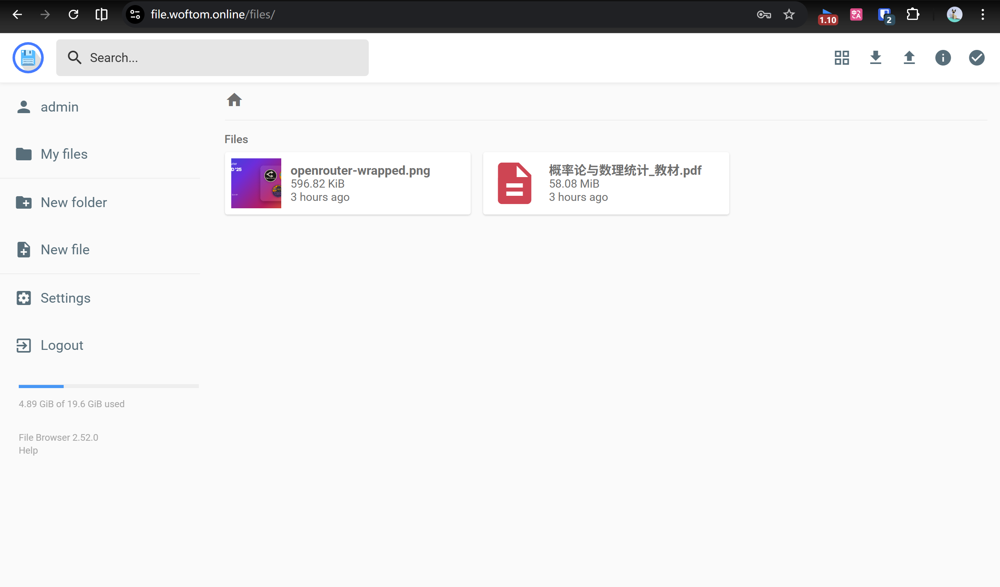

title: 200块的快乐！用DMIT服务器打造我的数字基地
date: 2025-12-24 18:00:00
tags: [VPS, Docker, Linux, Caddy, Self-hosted]
categories: [技术, 折腾日志]
cover: https://images.unsplash.com/photo-1558494949-efc535b5c4c1?q=80&w=2000&auto=format&fit=crop
---

今年圣诞特惠，我用这个价格在DMIT淘到了一台 **AMD EPYC 9654** 的高性能 VPS。经过几天的折腾，我在这台机器上搭建了属于自己的**私人网盘**、**密码管理器**和**科学网络节点**。

仅仅占用 300MB 内存，我就拥有了一个高速节点、一个私人网盘和密码管理器。

<!-- more -->

## 01. 硬件

先来看看这台机器的参数，看到 `AMD EPYC 9654` 的那一刻，我就知道赚到了。Debian 12 系统极其纯净，开机内存占用极低。

```bash
       _,met$$$$$gg.          root@j 
    ,g$$$$$$$$$$$$$$$P.       ------ 
  ,g$$P"     """Y$$.".        OS: Debian GNU/Linux 12 (bookworm) x86_64 
 ,$$P'              `$$$.     Host: KVM/QEMU (Standard PC (Q35 + ICH9, 2009) pc-q35-7.2) 
',$$P       ,ggs.     `$$b:   Kernel: 6.1.0-21-amd64 
`d$$'     ,$P"'   .    $$$    Uptime: 1 day, 18 hours, 31 mins 
 $$P      d$'     ,    $$P    Packages: 400 (dpkg) 
 $$:      $$.   -    ,d$$'    Shell: bash 5.2.15 
 $$;      Y$b._   _,d$P'      Resolution: 1280x800 
 Y$$.    `.`"Y$$$$P"'         Terminal: /dev/pts/0 
 `$$b      "-.__              CPU: AMD EPYC 9654 (1) @ 2.396GHz 
  `Y$$                        GPU: 00:01.0 Vendor 1234 Device 1111 
   `Y$$.                      Memory: 383MiB / 958MiB 
     `$$b.
       `Y$$b.                                         
          `"Y$b._                                     
              `"""
```

虽然只有 1G 内存，但对于 Go 和 Rust 编写的现代化轻量级应用来说，简直是豪宅。

## 02. 架构设计：Docker + Caddy

为了保证系统的干净和可维护性，我选择了 **全 Docker 化** 部署，并使用 **Caddy** 作为反向代理网关。

我的“数字堡垒”包含三个核心服务：
1.  **Filebrowser**: 文件中转站。
2.  **Vaultwarden**: Bitwarden 的 Rust 轻量版，管理所有密码。
3.  **基于X-ray的3x-ui**: 通向自由世界的钥匙。

### 域名规划
为了看起来更优雅，我使用了子域名隔离：
*   `file.woftom.online` -> 私人网盘
*   `flag.woftom.online` -> 密码库
*   `vps.woftom.online` -> X-ray 服务

## 03. 搭建实录：核心指令备份

为了方便复现，这里记录下核心服务的部署指令。环境基于 Debian 12 + Docker。

### 0. 3x-ui

#### 创建 docker-compose.yml

使用 **Host 网络模式** (`network_mode: host`)。
> **为什么要用 Host 模式？**
> 代理面板需要开放多个端口（面板端口、不同节点的代理端口等）。如果使用默认的 Bridge 模式，每次添加新节点都需要修改 docker-compose 文件并重启容器来映射端口，非常麻烦。Host 模式让容器直接共享宿主机的网络，所有端口随开随用，效率最高。

创建配置文件：

```bash
vim docker-compose.yml
```

```yaml
services:
  3x-ui:
    image: ghcr.io/mhsanaei/3x-ui:latest
    container_name: 3x-ui
    hostname: 3x-ui
    restart: unless-stopped
    network_mode: host
    volumes:
      - ./db/:/etc/x-ui/
      - ./cert/:/root/cert/
    # 环境变量配置
    environment:
      - XRAY_VMESS_AEAD_FORCED=false
      - XUI_ENABLE_FAIL2BAN=true
    privileged: true
```

#### 启动容器

```bash
docker compose up -d
```
*   `up`: 启动
*   `-d`: 后台运行 (Detached mode)

#### 搭建 Reality 节点

这部分步骤与非 Docker 版本完全一致，因为我们使用了 host 网络模式。

1.  **添加入站**：
    *   **协议**：`vless`
    *   **端口**：`443`
    *   **安全**：`reality`
    *   **流控 (Flow)**：`xtls-rprx-vision`
    *   **目标网站 (Dest)**：`www.microsoft.com:443`
    *   **SNI**：`www.microsoft.com`
    *   **uTLS**：`chrome`
2.  **生成密钥**：点击 "Get New Cert"。
3.  **添加**：保存节点。
4.  **使用**：复制链接到客户端。


### 1. Filebrowser：私人网盘 (端口 8080)

Filebrowser 官方镜像极其精简。为了避免权限问题，我采用了“先创建目录并放开权限，再启动容器”的策略。

```bash
# 1. 准备目录和空的数据库文件
mkdir -p /home/filebrowser/srv
mkdir -p /home/filebrowser/config
touch /home/filebrowser/config/filebrowser.db

# 2. 解决权限问题 (避免 permission denied)
chmod -R 777 /home/filebrowser

# 3. 启动 Docker 容器
docker run -d \
  --name filebrowser \
  --restart unless-stopped \
  -v /home/filebrowser/srv:/srv \
  -v /home/filebrowser/config/filebrowser.db:/database.db \
  -v /home/filebrowser/config:/config \
  -p 8080:80 \
  filebrowser/filebrowser
```

*部署完成后，使用 `docker logs filebrowser` 查看初始随机密码，登录后务必修改。*

### 2. Vaultwarden：密码管理器 (端口 8081)

考虑到安全，我在启动时直接加入了环境变量 `SIGNUPS_ALLOWED=false`，这样我自己注册完之后，别人就无法注册了。

```bash
# 1. 创建数据目录
mkdir -p /vw-data

# 2. 启动容器 (禁止新用户注册)
docker run -d \
  --name vaultwarden \
  --restart unless-stopped \
  -v /vw-data/:/data/ \
  -p 8081:80 \
  -e SIGNUPS_ALLOWED=false \
  vaultwarden/server:latest
```

### 3. Caddy：反向代理与自动 HTTPS

直接修改 `/etc/caddy/Caddyfile`，将域名请求转发给本地 Docker 端口。这使得我可以通过浏览器输入域名优雅的访问!

```caddy
# /etc/caddy/Caddyfile

# 私人网盘
file.woftom.online {
    reverse_proxy 127.0.0.1:8080
}

flag.woftom.online {
    reverse_proxy 127.0.0.1:8081
}
```

配置完成后，重载服务即刻生效：

```bash
systemctl reload caddy
```

**特别注意**：由于我的 443 端口原本被 X-ray 占用，导致 Caddy 启动失败。解决方案是将 X-ray 配置文件中的 `port` 修改为 `444`，让出 443 给 Caddy 处理 Web 流量。

## 04. 成果展示

### X-ray Proxy





### vaultWarden



### File browser




## 05. 总结

这一通折腾下来，不仅省了网盘会员费和密码管理软件的订阅费，更重要的是学到了 Linux 权限管理、Docker 容器化部署以及网络端口规划的知识。

Merry Christmas! 🎄