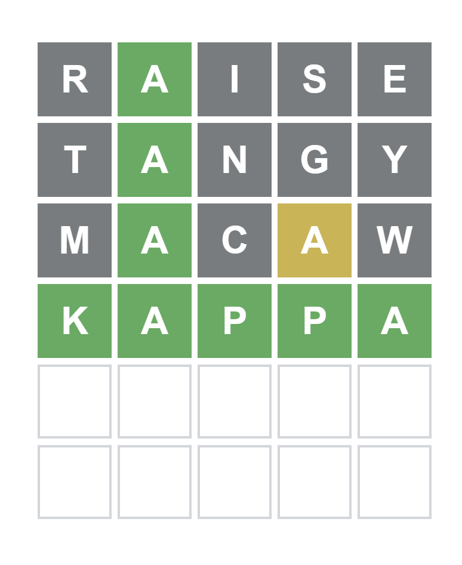

title: Learn Information Theory by Building a Wordle Bot
date: 2026-03-10 20:00:00
tags:
  - Python
  - Information Theory
  - Algorithms
categories:
  - Computer Science
mathjax: true
---

I recently decided to dive into Information Theory, absolutely not because it's my mandatory course. The standard "Bible" for the subject is *Elements of Information Theory* by Cover & Thomas. It's a brilliant book, but honestly, reading through a dense math textbook cover-to-cover is a quick way to kill my motivation. 

Instead, I decided to use a **Just-In-Time (JIT) learning method**: pick a project, and only open the textbook when I need the math to solve a specific problem. 

The project? **Building an AI that plays Wordle perfectly.**

It turns out, Wordle isn't just a vocabulary game. It is a pure manifestation of Claude Shannon’s 1948 mathematical framework for information. Here is how I translated Chapter 2 of the textbook into a Python script.

<!-- more -->

### The Big Idea: Shannon Entropy
When you play Wordle, you start with a dictionary of about 2,300 possible answers. Your goal is to shrink that list to 1. 

In Information Theory, your starting state is one of **high uncertainty**. Every time the game gives you colored squares (🟩🟨⬛), you gain **Information**, which reduces your uncertainty. 

The math formula for this uncertainty is called **Entropy** ($H$):
$$H(X) = - \sum p(x) \log_2 p(x)$$

To build the bot, I didn't need to mathematically prove this on paper. I just needed to write a script that loops through every possible guess, simulates what color patterns it *could* get, and calculates which guess gives the highest Entropy (i.e., shatters the remaining dictionary into the smallest possible buckets).

### Step 1: Handling Wordle's Annoying Double Letters
Before doing the high-level math, I had to write a function to simulate Wordle's color patterns. 

This is actually the hardest part of cloning Wordle because of how it handles double letters (e.g., if you guess "KAPPA" but the answer is "MACAW"). I used a two-pass algorithm with Python's `collections.Counter` to perfectly map Greens (2), Yellows (1), and Grays (0), and then converted the 5-color pattern into a single Base-3 integer.

```python
from collections import Counter
WORD_LENGTH = 5

def pattern_match(guess: str, word: str) -> int:
    patterns = [0] * WORD_LENGTH
    remaining = Counter()
    
    # First pass: mark greens and count leftover letters
    for i in range(WORD_LENGTH):
        if guess[i] == word[i]:
            patterns[i] = 2
        else:
            remaining[word[i]] += 1

    # Second pass: mark yellows using remaining counts
    for i in range(WORD_LENGTH):
        if patterns[i] == 0:
            if remaining[guess[i]] > 0:
                patterns[i] = 1
                remaining[guess[i]] -= 1

    # Convert ternary pattern to an integer (Base-3)
    pattern_num = 0
    for p in patterns:
        pattern_num = pattern_num * 3 + p
    return pattern_num
```

### Step 2: Translating the Math to Code
Next, I wrote the Entropy calculator. For a specific guess, we look at all remaining valid answers, calculate the pattern we'd get for each, and tally them up in `bucket`. Then, we apply Shannon's formula.

```python
import math
SAMPLE_SPACE_LENGTH = 3**WORD_LENGTH # 243 possible color patterns

def entropy(guess: str, candidate: list[str]):
    bucket = [0 for _ in range(SAMPLE_SPACE_LENGTH)]
    
    # Tally up how the dictionary splits for this guess
    for word in candidate:
        index = pattern_match(guess, word)
        bucket[index] += 1
        
    entropy_val = 0
    probabilities = [float(i)/len(candidate) for i in bucket]

    # H(x) = - Sum( p * log2(p) )
    for p in probabilities:
        if p > 0:
            entropy_val -= p * math.log2(p)
            
    return entropy_val
```

### Making it Blazingly Fast
At first, calculating the very first turn meant checking ~2,300 guesses against ~2,300 targets. That is over 5 million loops. pure Python is slow at this. 

To optimize it:
1. **Hardcoded the First Guess:** The first turn's math never changes because the dictionary is always the same. My script found that **"RAISE"** is the mathematically optimal starting word. Hardcoding `RAISE` for loop 1 skips millions of calculations instantly.
2. **State Space Collapse:** After guessing RAISE, the list of 2,300 words drops to around 40 or 50 words. Suddenly, the script runs in milliseconds for the rest of the game!

### The "Aha!" Moment: Beating the Game
When I finally wired up the terminal UI and tested it, the feeling was unreal. I watched it solve the incredibly obscure word **KAPPA** in exactly 4 guesses.



Here is what the bot's internal log looked like:
1. Guessed **RAISE**. Got `02000` (Only the A is green).
2. The bot instantly slashed the 2,300 word list down to a fraction. It calculated the new optimal guess: **TANGY**.
3. It got `02000` again. Next mathematical guess: **MACAW**.
4. By getting the yellow A in MACAW, the entropy of the remaining list hit 0 bits. Total certainty. The only word left in the English language was **KAPPA**.

### Conclusion
Building this taught me a lot about Information Theory.

Now that my bot is solving Wordle, it's time to do some exercises in Cover & Thomas.